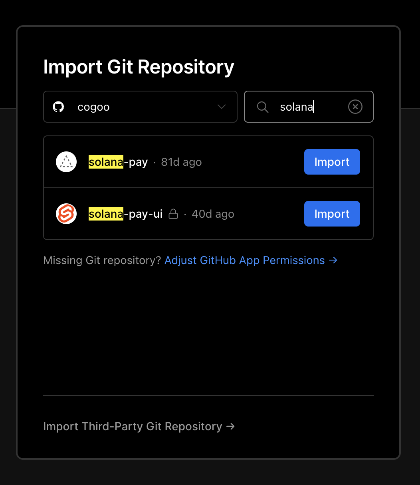
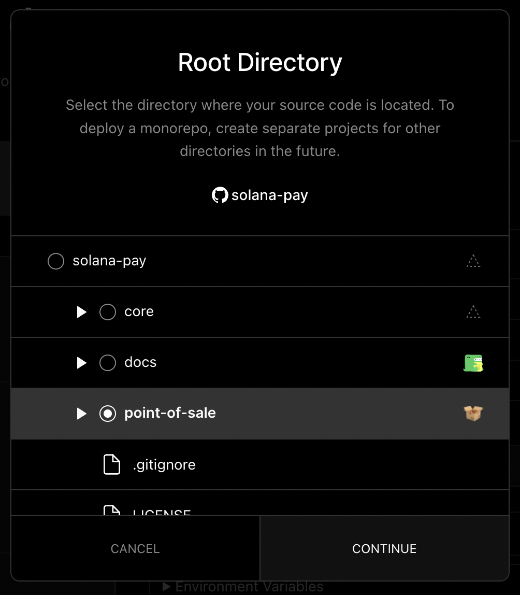
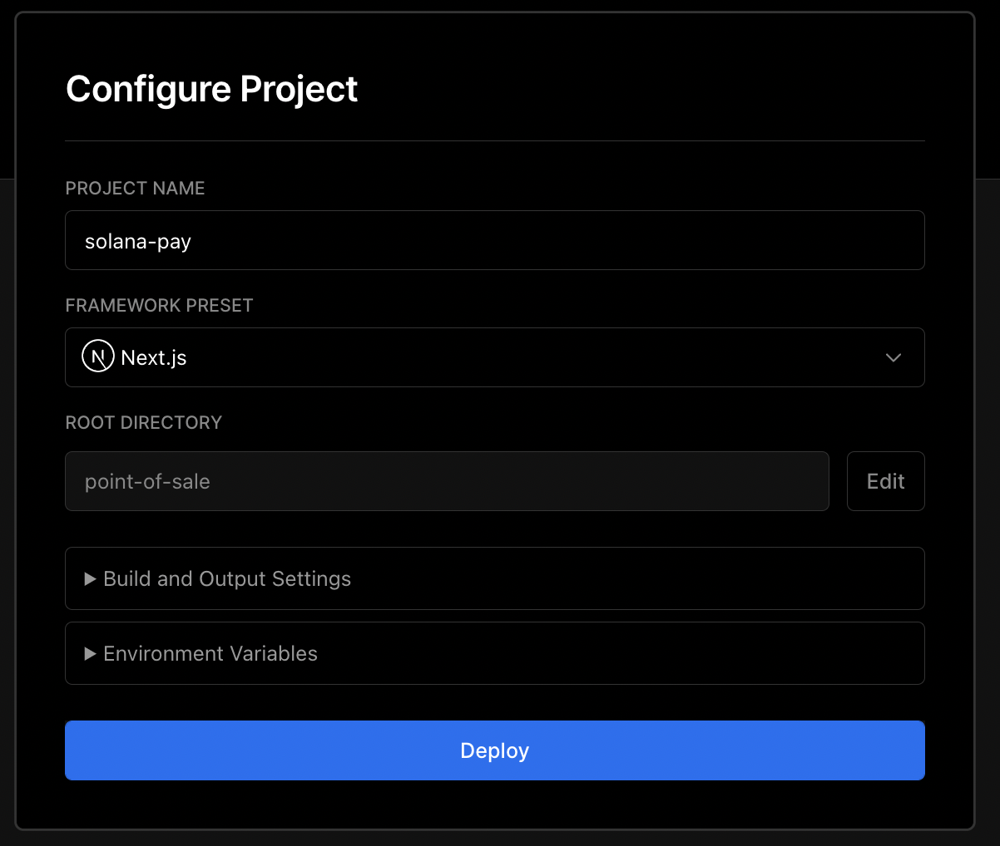

# Point of Sale

This is an example of how you can use the `@solana/pay` JavaScript library to create a simple point of sale system.

You can [check out the app](https://app.solanapay.com?recipient=GvHeR432g7MjN9uKyX3Dzg66TqwrEWgANLnnFZXMeyyj&label=Solana+Pay), use the code as a reference, or run it yourself to start accepting decentralized payments in-person.

## Prerequisites

To build and run this app locally, you'll need:

- Node.js v14.17.0 or above
- Yarn
- <details>
        <summary> Setup two wallets on <a href="https://phantom.app">Phantom</a> (Merchant and Customer) </summary>

  #### 1. Create merchant wallet

    Follow the [guide][1] on how to create a wallet. This wallet will provide the recipient address.

  #### 2. Create customer wallet

    Follow the [guide][1] on how to create another wallet. This wallet will be paying for the goods/services.

  #### 3. Set Phantom to connect to devnet

    1. Click the settings icon in the Phantom window
    2. Select the "Change network" option and select "Devnet"

  #### 4. Airdrop SOL to customer wallet

    Use [solfaucet][3] to airdrop SOL to the customer wallet.

    > You'll need SOL in the customer wallet to pay for the goods/services + transaction fees

 </details>

## Getting Started

These instructions will get you a copy of the project up and running on your local machine for development and testing purposes.

### Clone the repository

#### With Git

```shell
git clone https://github.com/solana-labs/solana-pay.git
```

#### With Github CLI

```shell
gh repo clone solana-labs/solana-pay
```

### Install dependencies

```shell
cd solana-pay/examples/point-of-sale
npm install
```

### Start the local dev server

```shell
npm run dev
```

### In a separate terminal, run a local SSL proxy

```shell
npm run proxy
```

### Open the point of sale app

```shell
open "https://localhost:3001?recipient=Your+Merchant+Address&label=Your+Store+Name"
```

You may need to accept a locally signed SSL certificate to open the page.

## Accepting USDC on Mainnet

Import the Mainnet endpoint, along with USDC's mint address and icon in the [`client/components/pages/App.tsx`](https://github.com/solana-labs/solana-pay/blob/master/examples/point-of-sale/src/client/components/pages/App.tsx) file.

```tsx
import { MAINNET_ENDPOINT, MAINNET_USDC_MINT } from '../../utils/constants';
import { USDCIcon } from '../images/USDCIcon';
```

In the same file, set the `endpoint` value in the `<ConnectionProvider>` to `MAINNET_ENDPOINT` and set the following values in the `<ConfigProvider>`:

```tsx
splToken={MAINNET_USDC_MINT}
symbol="USDC"
icon={<USDCIcon />}
decimals={6}
minDecimals={2}
```

**Make sure to use 6 decimals for USDC!**

When you're done, it should look like this:

```tsx
<ConnectionProvider endpoint={MAINNET_ENDPOINT}>
    <WalletProvider wallets={wallets} autoConnect={connectWallet}>
        <WalletModalProvider>
            <ConfigProvider
                baseURL={baseURL}
                link={link}
                recipient={recipient}
                label={label}
                message={message}
                splToken={MAINNET_USDC_MINT}
                symbol="USDC"
                icon={<USDCIcon />}
                decimals={6}
                minDecimals={2}
                connectWallet={connectWallet}
            >
```

## Using Transaction Requests

[Transaction Requests](https://github.com/solana-labs/solana-pay/blob/master/SPEC.md#specification-transaction-request) are a new feature in Solana Pay.

In the [`client/components/pages/App.tsx`](https://github.com/solana-labs/solana-pay/blob/master/examples/point-of-sale/src/client/components/pages/App.tsx) file, toggle these lines:

```tsx
    // Toggle comments on these lines to use transaction requests instead of transfer requests.
    const link = undefined;
    // const link = useMemo(() => new URL(`${baseURL}/api/`), [baseURL]);
```

When you're done, it should look like this:

```tsx
    // Toggle comments on these lines to use transaction requests instead of transfer requests.
    // const link = undefined;
    const link = useMemo(() => new URL(`${baseURL}/api/`), [baseURL]);
```

The generated QR codes in the app should now use transaction requests. To see what's going on and customize it, check out the [`server/api/index.ts`](https://github.com/solana-labs/solana-pay/blob/master/examples/point-of-sale/src/server/api/index.ts) file.

## Deploying to Vercel

You can deploy this point of sale app to Vercel with a few clicks.

### 1. Fork the project

Fork the Solana Pay repository

### 2. Login to Vercel

Login to Vercel and create a new project


Import the forked repository from GitHub.



> If you're forked repository is not listed, you'll need to adjust your GitHub app permissions. Search for the and select the `Missing Git repository? Adjust GitHub App Permissions` option.

### 3. Configure project

Choose `point-of-sale` as the root directory:



Configure the project as follows:



### Deploy project

Once the deployment finishes, navigate to

`
https://<YOUR DEPLOYMENT URL>?recipient=<YOUR WALLET ADDRESS>&label=Your+Store+Name
`

## License

The Solana Pay Point of Sale app is open source and available under the Apache License, Version 2.0. See the [LICENSE](./LICENSE) file for more info.

<!-- Links -->

[1]: https://help.phantom.app/hc/en-us/articles/4406388623251-How-to-create-a-new-wallet
[3]: https://solfaucet.com/
